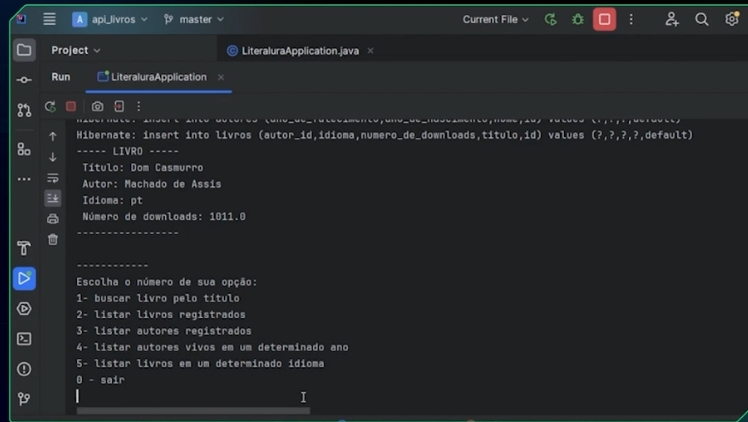

# Challenge ONE 

É uma forma de implementar o Challenge Based Learning, ou seja, aprendizado baseado em desafios que a Apple ajudou a criar. É um mecanismo que permite que você se comprometa com a resolução de um problema e então investigue
soluções com cursos, conteúdo e palestras, ou até mesmo com o conhecimento que você já tem! Finalmente, você vai agir e colocar o seu projeto no ar. Tudo isso enquanto comenta e ajuda em projetos de outros alunos e alunas.

## LiterAlura Api Gutendex 📚

O desafio atual, escolhemos a API "Gutendex", uma API que retém dados de mais de 70 mil livros da biblioteca online e gratuita chamada Projeto Gutenberg, apresentando além do título e autores, dados como idiomas, formato do texto e quantidade de downloads. 
E o melhor de tudo, é gratuita, fácil de usar e não exige chave de acesso!

##  Objetivos do projeto

O objetivo principal deste challenge é que você viva a experiência de realizar um projeto real, tal como ocorre no dia a dia de uma pessoa desenvolvedora; 
você terá a oportunidade de praticar os conceitos aprendidos nos cursos realizados até agora.
O objetivo do desafio é justamente realizar o consumo de uma API e praticar a persistência de dados em um banco de dados relacional.

## Desafio proposto

Construir próprio catálogo de livros e realizar o consumo de uma API e praticar a persistência de dados em um banco de dados relacional.

## Resultado obtido

 